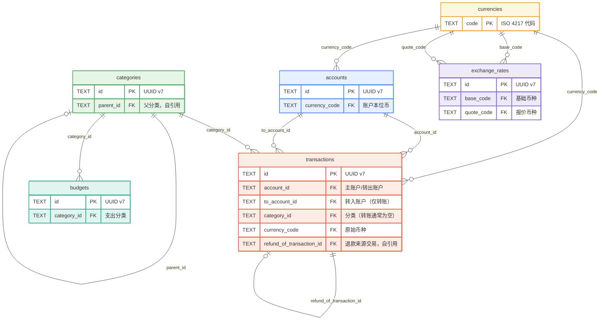
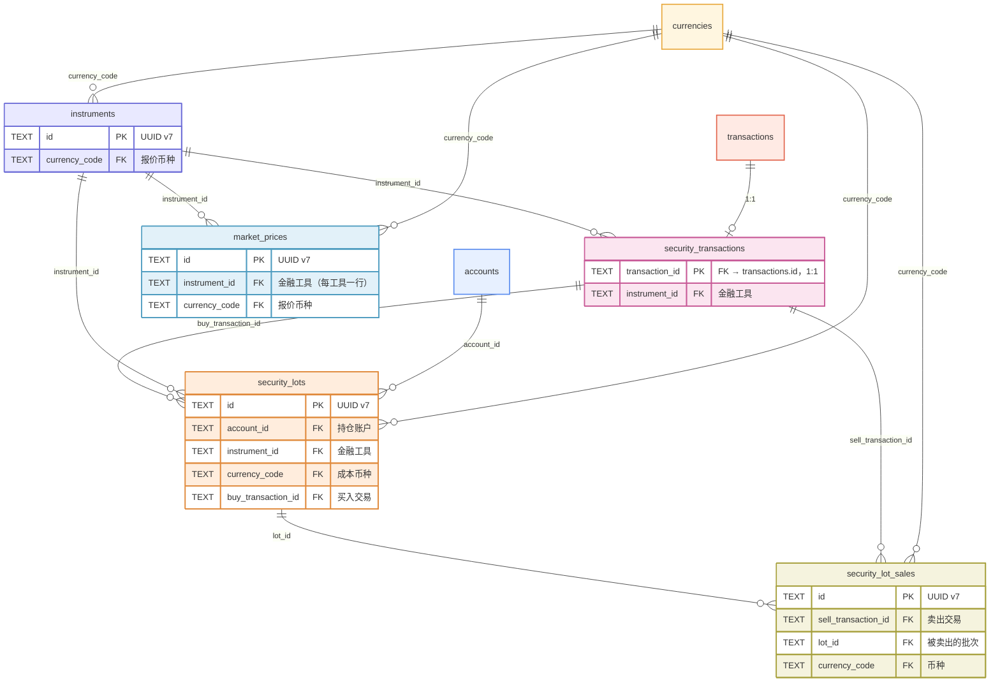
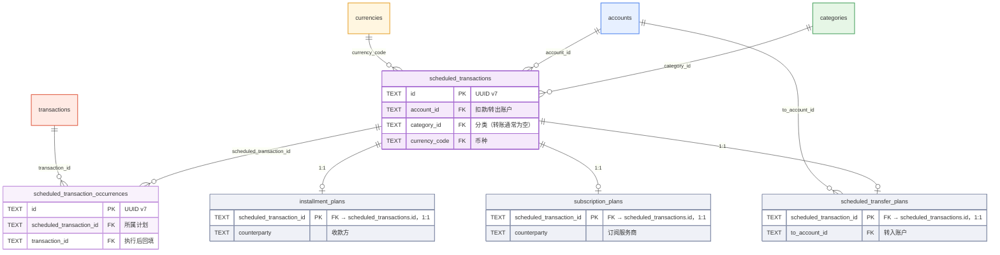

# Ledger 数据模型设计

## 设计概述

Ledger 采用 SQLite 作为本地数据库，面向**多设备同步的离线优先**架构设计。

### 核心设计原则

1. **离线优先**：所有数据本地存储，支持无网络环境下正常使用
2. **多设备同步**：通过同步字段（device_id, updated_at, version, is_deleted）支持 LWW（Last Write Wins）冲突解决
3. **软删除**：所有主表使用 `is_deleted` 标志，不物理删除数据，保证同步一致性
4. **金额整数化**：所有金额以「分」为单位存储为整数，避免浮点精度问题
5. **UUID v7 主键**：全局唯一标识符，时间有序，适合分布式场景

---

## 实体索引

### 核心实体
- [currencies（币种）](./basic/currencies.md)
- [accounts（账户）](./basic/accounts.md)
- [categories（分类）](./basic/categories.md)
- [transactions（交易）](./basic/transactions.md)
- [budgets（预算）](./basic/budgets.md)
- [exchange_rates（汇率）](./basic/exchange-rates.md)

### 投资相关实体
- [instruments（金融工具）](./investment/instruments.md)
- [security_transactions（证券交易扩展）](./investment/security-transactions.md)
- [security_lots（持仓批次）](./investment/security-lots.md)
- [security_lot_sales（批次卖出匹配）](./investment/security-lot-sales.md)
- [market_prices（市场价格）](./investment/market-prices.md)
- [v_holdings（持仓视图）](./investment/holdings-view.md)

### 搜索索引（设计阶段，未落地）
- [search_transactions（交易搜索索引）](./basic/search-transactions.md)（仅 ADR-0004 设计，migration 尚未新增）

### 计划交易
- [scheduled_transactions 模块概览](./scheduled-transactions/index.md)
- [installment_plans（分期计划）](./scheduled-transactions/installment.md)
- [subscription_plans（订阅计划）](./scheduled-transactions/subscription.md)
- [scheduled_transfer_plans（计划转账）](./scheduled-transactions/scheduled-transfer.md)

---

## 关系图

> 模型关联按领域拆分为三个 Mermaid ER 图（核心 / 投资 / 计划交易），便于阅读；`v_holdings` 为视图（聚合 security_lots，LEFT JOIN accounts / market_prices / exchange_rates 计算市值与未实现盈亏），不作为实体列出。

> **配色图例**：币种（黄）、账户（蓝）、分类（绿）、交易（红）、预算（青）、汇率（紫）为核心表；投资域用靛蓝（工具）/ 粉（证券扩展）/ 橙（持仓批次）/ 橄榄（卖出匹配）/ 天蓝（行情）；计划域核心与期次为紫色系，三类扩展表为灰色。同一表在不同图中颜色一致。实体文字颜色跟随主题自适应，未手动覆盖。

### 核心领域（币种 · 账户 · 分类 · 交易 · 预算 · 汇率）

### 投资领域（工具 · 证券交易 · 持仓批次 · 卖出匹配 · 行情）

### 计划交易领域（核心计划 · 期次 · 三类扩展）

**核心关系**：所有外键关联已在上方三个 ER 图中完整表达；各外键的 ON DELETE 语义（RESTRICT / SET NULL / CASCADE）与自引用说明见对应实体文档的「被引用关系」小节。

---

## 同步机制

### 同步字段

主表（accounts, categories, transactions, budgets, scheduled_transactions, scheduled_transaction_occurrences）均携带：

- **device_id**：创建/最后修改设备标识
- **updated_at**：最后修改时间（UTC ISO 8601）
- **version**：版本号（每次修改 +1）
- **is_deleted**：软删除标志（0/1）

投资与汇率表（instruments, security_lots, market_prices, exchange_rates）携带 **device_id / updated_at / version**，但**无 is_deleted**（不参与软删除）；`security_lot_sales` 为审计流水表，仅 `created_at`，不参与同步。

### LWW 冲突解决

- 比较 updated_at 时间戳，取最新者胜出
- version 字段用于乐观锁和变更追踪
- 软删除保证删除操作可同步

### 同步索引

所有主表均建立 `(updated_at, device_id)` 复合索引，用于高效查询某设备在某时间后的变更。

---

## 金额存储策略

### 整数存储

- 所有金额字段以「分」为单位存储为 INTEGER
- 避免浮点精度问题
- 展示时根据 currencies.decimal_places 格式化

### 多币种支持

- transactions 同时存储 amount_cents（原始币种）和 amount_native_cents（本位币）
- 当前实现中两者 1:1 相等，预留多币种换算能力
- exchange_rates 表提供汇率数据
- v_holdings 视图通过汇率折算计算账户币种市值

---

## 主键策略

### UUID v7

- 所有主表主键使用 UUID v7（TEXT 类型存储）
- 全局唯一，适合分布式场景
- 时间有序，利于索引和排序
- 默认分类使用基于 name+kind 的确定性 UUID v5，保证所有设备初始化后默认分类的 ID 一致

---

## 扩展性设计

### 已预留能力

1. **多币种**：exchange_rates 表、transactions.amount_native_cents 字段
2. **投资交易**：完整的证券交易、持仓批次、盈亏计算体系
3. **分类层次**：支持两级分类，可扩展更深层级
4. **软删除**：所有主表支持，保证同步一致性
5. **版本控制**：version 字段支持乐观锁和变更追踪

### 当前未实现

1. **多币种换算**：汇率表存在，但当前 MVP 阶段 transactions 的 amount_native_cents 与 amount_cents 1:1 相等，尚未根据实际汇率折算
2. **分类深层级**：数据库支持两级，未实现更深层级
3. **计划交易自动执行**：scheduled_transactions 模块 schema 完整，尚未接入定时执行逻辑

---

## 参考

- Migrations：`src-tauri/migrations/V001__initial.sql`, `V002__investment.sql`, `V003__scheduled_transactions.sql`, `V004__seed_defaults.sql`, `V005__instruments_market.sql`
