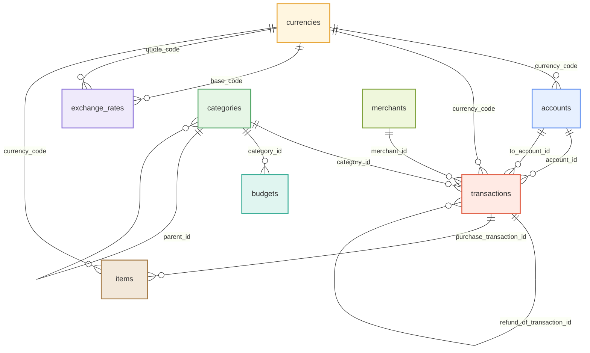
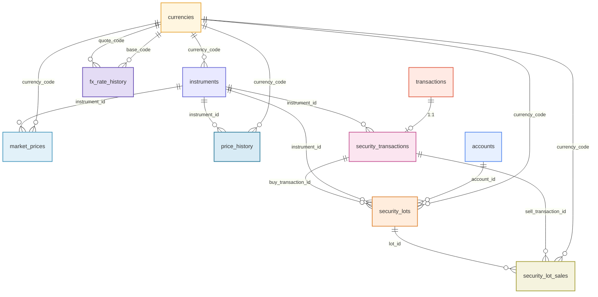
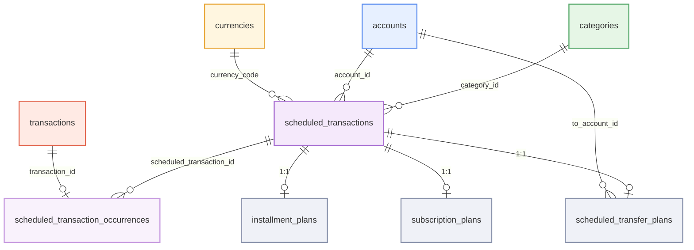

# Ledger 数据模型设计

Ledger 采用 SQLite 作为本地数据库，面向**多设备同步的离线优先**架构。表结构、索引、约束、触发器与种子数据的**唯一事实来源是 migration**（`src-tauri/migrations/`，索引见文末）；本文不复述任何可从 migration 与代码查出的细节，只保留设计动机与实体关系总览。

## 设计原则

- **离线优先**：所有数据本地存储，无网络环境可正常使用；同步、软删除等后续选择皆由此而来。
- **多设备同步（LWW）**：主业务表携带 device_id / updated_at / version / is_deleted 同步字段，多设备并发写时比较 updated_at 取最新者胜（Last Write Wins），version 兼作乐观锁。同步字段的逐表清单以 migration 为准。
- **软删除**：主业务表以 is_deleted 标志代替物理删除——删除操作变成一条可同步、可追溯的数据变更，是离线多端复制的必要条件。
- **金额整数分 + raw/native 分离**：金额一律以「分」存整数，避免浮点精度问题；transactions 同时存 amount_cents（原始币种）与 amount_native_cents（本位币折算），报表与预算才能跨币种汇总。折算语义与 kind→度量口径唯一收口于 Amount 接缝（ADR-0011），改动金额逻辑只改接缝一处，不要另写口径表达式。
- **UUID v7 主键**：主业务表主键用 UUID v7（TEXT 存储），设备端可独立生成、全局唯一；时间有序带来良好的索引局部性，也让按主键排序近似按创建时间排序。
- **默认数据确定性种子（UUID v5）**：默认分类基于 name+kind 生成确定性 UUID v5，保证所有设备初始化后默认分类的 ID 一致，同步合并不产生重复字典行。

## 外键约定（ON DELETE）

全库所有跨表引用列均为启用强制的外键（连接统一 `PRAGMA foreign_keys = ON`），删除语义遵循四条约定。逐列动作以 migration 为唯一事实来源；「每个外键都显式声明动作」由迁移审计测试守护（无白名单），新增迁移漏写会确定性失败。

1. **引用列必须 `REFERENCES` + 显式 `ON DELETE`**：漏写会落到 SQLite 默认 `NO ACTION`，阅读 schema 时必须额外记忆默认行为才能推断删除语义——禁止。
2. **强依赖 → `RESTRICT`**：行对被引用对象存在存续依赖、置空不可行（如账户的本位币、预算的分类、定时计划的账户），删除被引用行被数据库拒绝，须先解除依赖。
3. **溯源指针 → `SET NULL`**：可空引用记录「来源/关联」事实而非存续依赖（如交易的分类/商户/退款原交易、期次生成的交易），被引用行删除时置空、行本身保留。
4. **扩展行 → `CASCADE`**：依附父行存续的扩展数据随父行删除级联消失（如期次与分期/订阅/定时转账三张扩展表、证券批次与卖出匹配），应用层不手写多表删除。

**软删前提**：主业务表删除一律软删（见「设计原则」），上述 `ON DELETE` 语义仅在显式硬删（含未来 purge 功能）时生效。V003 曾就地修改补全显式动作，已执行过旧版迁移的存量库与旧备份恢复路径保持 `NO ACTION`——差异当前不可达、零行为差异，首个依赖新语义的功能发布时自带收敛迁移（见 V003 头部注记与 CHANGELOG）。

## 实体关系总览

> 实体清单、字段与外键的逐列 ON DELETE 语义以 migration 为唯一事实来源（三类动作的分工见上方「外键约定」）；以下三图只呈现领域结构与关系基数。`v_holdings` 为视图（聚合 security_lots 计算市值与未实现盈亏），不作为实体；`app_settings` 为无外键的 KV 表，不进图，经领域命令读写（ADR-0017）。

**配色图例**：币种（黄）、账户（蓝）、分类（绿）、商户（黄绿）、物品（棕）、交易（红）、预算（青）、汇率（紫）为核心域；投资域用靛蓝（工具）/ 粉（证券扩展）/ 橙（持仓批次）/ 橄榄（卖出匹配）/ 天蓝（现价）/ 深天蓝（价格历史）/ 深紫（汇率历史）；计划域核心与期次为紫色系，三类扩展表为灰色。同一表在不同图中颜色一致。实体文字颜色跟随主题自适应，未手动覆盖。

### 核心领域（币种 · 账户 · 分类 · 商户 · 物品 · 交易 · 预算 · 汇率）

### 投资领域（工具 · 证券交易 · 持仓批次 · 卖出匹配 · 行情 · 价格/汇率历史）

### 计划交易领域（核心计划 · 期次 · 三类扩展）

## 定时计划模块

- 「核心表 + 扩展表」的结构决策见 ADR-0003（取代 ADR-0002 的完全独立模型方案）；计划生命周期、周期规则、失败策略等 MVP 行为决策见 ADR-0024。
- **期次执行的失败语义**（ADR-0024 未覆盖的补充）：执行失败直接返回错误，期次状态保持 pending 不变，重试即再次执行该期次；`failed` 为 schema 预留状态，当前没有写入路径。引擎单期执行的事务边界与失败残留处理见 ADR-0033 决策 #6；语义定义点见定时计划域词汇表 Failure Policy 条目。
- **CAS 并发控制**（ADR-0024 未覆盖的补充）：基于 version 的乐观锁保证一期在多设备间只会被执行一次——执行设备先抢占（status→processing 且 version+1），仅抢占成功者生成交易并回填 transaction_id；同步时发现 transaction_id 已存在即跳过执行，避免多设备重复扣款或转账。

## Migration 索引

| 迁移 | 内容 |
|---|---|
| `V001__initial.sql` | currencies / accounts / categories / merchants / transactions / budgets / exchange_rates 表结构、索引、CHECK 约束 |
| `V002__investment.sql` | 投资域五表 + `v_holdings` 视图 |
| `V003__scheduled_transactions.sql` | 计划交易核心表、期次表与三张扩展表 |
| `V004__seed_defaults.sql` | 币种与分类种子数据（含黑洞账户） |
| `V006__transaction_amount_index.sql` | 金额筛选索引 |
| `V007__transaction_idempotency_key.sql` | 幂等键列 + 部分唯一索引 |
| `V008__app_settings.sql` | `app_settings` KV 表 |
| `V009__items.sql` | 物品（items）表 |
| `V010__price_history.sql` | `price_history` / `fx_rate_history` 周粒度历史表 |
| `V011__instruments_source.sql` | 标的字典来源列（同步 / 手动标记，ADR-0036） |

> 迁移版本由 SQLite `user_version` 自动追踪，新迁移在数据库模块统一注册。V005（FTS5 搜索索引）已随统一模糊搜索方案移除（ADR-0027），编号不复用。新增 schema 变更时新建 `V00X__名称.sql` 并在注册处追加；已发布迁移的就地修改与 BREAKING 标记要求见 AGENTS.md 发布约定。
